# Adding Tutorial Content for the MHCP Doc Mini Challenge

This document outlines the standard procedure for adding or updating documentation for the MHCP Doc Mini Challenge. It involves forking the main repository, making changes in your fork, and then submitting a Pull Request to the main repository, all using the GitHub web interface.

When contributing documentation, please ensure your additions or edits fit into one of the existing high-level documentation folders/categories. If you are unsure where your contribution belongs, please discuss it with the project maintainers.

## 1\. Prerequisites

* A GitHub account.
* Familiarity with Markdown syntax.
* A basic understanding of what forking a repository means.

## 2\. Procedure

The process of contributing documentation is broken down into two main phases:

1. **Initial Setup**: A one-time (or infrequent) process to prepare your environment by forking the repository.
2. **Contribution Workflow**: The set of steps you'll follow each time you want to add or update documentation.

---

### 2.1. Initial Setup (One-time or Infrequent)

This section covers the steps you need to take once to set up your own copy (fork) of the main documentation repository.

[https://github.com/MHCPPrograms/worlds-documentation](https://github.com/MHCPPrograms/worlds-documentation)

#### 2.1.1. Fork the Repository

Forking creates your own copy of the project repository where you can make changes without affecting the original project.

1. Navigate to the main page of the **original (upstream)** repository on GitHub (this is the project you want to contribute to).
2. In the top-right corner of the page, click the **"Fork"** button.
   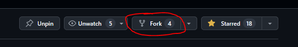
3. If prompted (e.g., if you belong to multiple organizations), select your GitHub account as the destination for the fork.

4. You will be redirected to your newly created fork (e.g., `https://github.com/your-username/repository-name`). This is now your personal copy.

---

### 2.2. Contribution Workflow (For Each Documentation Change)

Once you have your fork set up, follow these steps to submit or update your tutorial for the MHCP Doc Mini Challenge.

#### 2.2.1. Add or Edit Documentation Files (in Your Fork)

On your main branch, add or edit documentation files. **Crucially, place your files in the correct category folder that corresponds with the tutorial challenge category you are creating content for.** If you're unsure about the correct category, please consult with project maintainers before proceeding.

**Documentation Categories:**

| Category Folder Name | Description | Challenge Category |
| :---- | :---- | :---- |
| `lighting-colliders-audio` | Details lighting techniques, collider setup for interaction, and audio integration. | Best Lighting |
| `asset-library-import` | Focuses on using the asset library, templates, and managing assets. | Best Creating and Importing Assets and Best Using Asset Templates |
| `monetization` | Discusses monetization options, in-world purchases, and player progression. | Best Monetization |
| `performance` | Addresses performance optimization, debugging, and best practices. | Best Optimizing World Performance |
| `npcs` | Details NPC creation, AI, and behavior. | Best NPC Enemy Wave |

Before beginning, verify you are in **your forked repository** and on the branch created for these specific changes.

To **add a new file**:

   1. Using the table above, identify the **appropriate category folder** for your new file (e.g., `docs/npcs/`).
   1. Navigate to the folder.
   1. Click the **"Add file"** button and select either **"Create new file"** or **"Upload files"**.
     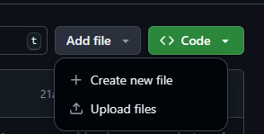
      * If creating a new file:
         * Enter the name for your file in the name field (e.g., `new-guide.md`).
         * Write or paste your Markdown content into the editor.
            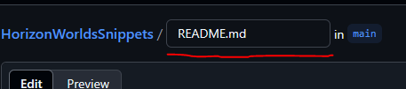
      * If uploading files:
         * Drag and drop your file(s) or use the file chooser to select them.

To **edit an existing file**:
   1. Navigate to the file you want to edit within your fork.
   1. Click the **pencil icon** (which usually says "Edit this file") on the right side of the file view.
   1. Make your desired changes in the editor.

      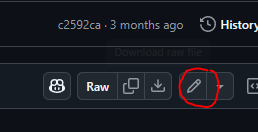

#### 2.2.2. Linking to YouTube Videos

If you are creating a short-form video to accompany your written tutorial, upload it to YouTube and then follow the steps below to embed the video in your Markdown file.

1. Go to the video
2. Click Share
   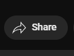
3. Click Embed
   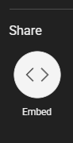
4. Copy and paste the Embed Video code to the File Editor in GitHub
   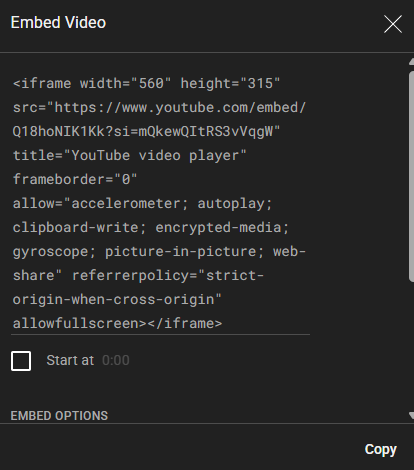

**Note:** No preview will be available because iframe is not supported in markdown. Please use the GitHub

#### 2.2.3. Commit Your Changes (in Your Fork)

Save your work by committing the changes to your branch in your fork.

1. After creating, uploading, or editing a file **in your fork**, press the **"Commit changes"** button.
   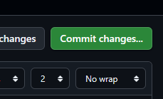
2. **Commit message:** Write a clear and concise commit message.
   * The first line should be a short summary (max 50-72 characters is a good guideline), e.g., `docs: New tutorial on lighting`.
   * *Good commit message practice:* Start with a prefix indicating the type of change (e.g., `docs:`, `fix:`), followed by a concise description.
3. Ensure the option **"Commit directly to the `main` branch"** is selected. This refers to the branch in your fork.
4. Click the green **"Commit changes"** button.

#### 2.2.4. Create a Pull Request (PR) from Your Fork to the MHCPPrograms/worlds-documentation Repository

You are almost done! The Pull Request (PR) submission process is how you propose your changes to the doc mini challenge Github repo.

1. After committing your changes to your branch **in your fork**, navigate to the main page of **your forked repository** on GitHub.
2. You should see a prominent notification bar for your recently pushed branch, often with a **"Contribute"** button. Click this button.
   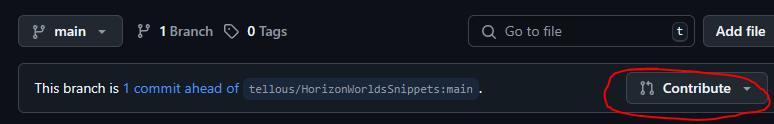
3. If you don't see this prompt:
   * Go to the **"Pull requests"** tab of **your forked repository** and click **"New pull request"**.
     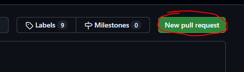
   * Alternatively, go to the **"Pull requests"** tab of the **original (upstream) repository** and click **"New pull request"**. You may then need to click "compare across forks".

4. You will be taken to the **"Open a pull request"** page. Carefully review the branches:
   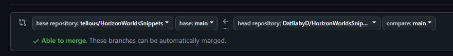
   * **Base repository:** This should be the **original (upstream) repository** you forked from (e.g., `original-owner/repository-name`).
   * **Base branch:** This is the branch in the original repository you want your changes merged into (commonly `main` or `master`).
   * **Head repository:** This should be **your fork** (e.g., `your-username/repository-name`).
   * **Compare branch** (or **Head branch**): This should be the branch in your fork that contains your changes (e.g., `<your-branch-name>`).
   * GitHub usually selects these correctly if you used the "Contribute" button from your fork. If not, use the dropdown menus to select the correct repositories and branches.
5. **Title:** Write a clear and descriptive title for your PR and incluce the challenge category in your title. The main commit message is often a good starting point.
   * Example: `lighting: Cool uses of Dynamic Lighting`
6. **Description:** In the text area, provide a summary of your changes.
   * When submitting your tutorial for the first time, list the tutorial category and what your tutorial covers.
   * When updating an existing tutorial, describe the changes.
7. Click **"Create pull request"**. This submits your changes for review to the maintainers of the original repository.
   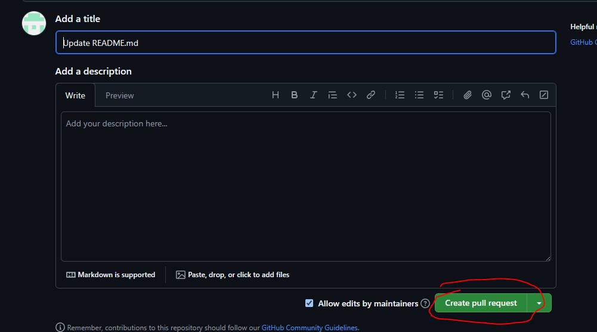

#### 2.2.5. Review Process

After submitting your PR, project maintainers will review your contribution.

1. Maintainers of the MHCP competition repository will review your changes. They may ask questions, request modifications, or suggest improvements directly on the PR page using comments and review tools.
2. Monitor your PR for feedback. You will typically receive notifications from GitHub.
3. If changes are requested, address the feedback by making further edits and commits to your branch **in your forked repository**. New commits pushed to that branch in your fork will automatically update the existing Pull Request.

#### 2.2.6. Merging the Pull Request

Once your PR is approved and any automated checks pass, a maintainer will merge it.

1. After any necessary discussions and revisions, if the maintainers are satisfied, they will merge your PR into the `main` (or target) branch of the MHCPPrograms/worlds-documentation repository used for this doc mini challenge.
2. Your tutorial has now been successfully submitted for the MHCP Doc Mini Challenge! If you need to make updates to your submission, you can do so until the contest ends.

#### 2.2.7. Keep Fork Up-to-Date

If you need to make further updates, it's a good practice to keep your fork's main branch in sync with the upstream repository. Occasionally, press the "Sync Fork" button on **your forked repository's** main page to retrieve any updates to the **original (upstream) repository**.

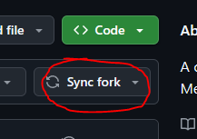

---

## 3\. Frequently Asked Questions (FAQ)

**Q: I’ve already written tutorials for the community. Can I submit one of those?**

A: Yes, but the submission must be materially different than the original content you wrote (i.e. it goes into greater detail, covers additional areas, etc.)

**Q: Can I submit more than one tutorial for judging?**

A: Yes, you can submit more than one tutorial, but longer, more detailed, and higher-effort submissions are more likely to win. We recommend focusing on one great submission rather than multiple lower-quality submissions.

**Q: Can one submission win more than one prize?**

A: Each submission is limited to one top prize (“Best Overall Tutorial”) and a max of one additional special category, aligning to the overall rules of the competition.

**Q: Will my contribution to the Doc Mini Challenge automatically be merged into the main MHCPCreators/wolds-documentation repo?**

A: Winning submissions as well as other submissions of sufficiently high quality will be candidates for merging to the MHCPCreators documentation repo. You may be asked to do some additional editing before it is ready to merge into the main documentation site (such as minor typo fixes, clarifications, figuring out which category it goes into, etc). The maintainers of the MHCPCreators repo will reach out to you when your document is selected for incorporation into the main repo.
