# Text Entry Tutorial
Author: Laex05

In this tutorial, you'll explore efficient methods for importing and manipulating text in Meta Horizon Worlds using TypeScript. You'll learn the simplest ways to integrate large blocks of text, to format text using TypeScript code, and you'll even learn how to create text dynamically.

You can use the example code in this tutorial can be used by creators of all skill levels. Don't worry if you're new to TypeScript. By the end of this tutorial, you'll be able to import text, format text, and create exciting, randomized game mechanics that surprise and engage your visitors.

* Creator skill Level: All levels
* Required background knowledge: No prior skills required.
* Recommended background knowledge: Horizon Desktop Editor, TypeScript, VS Code, Codeblocks.

**Note:** This tutorial contains TypeScript code that you can download. This code was provided by MHCP mentor Laex05 and Vidyuu team. If you encounter any issues with the TypeScript code, you can contact info@vidyuu.com, or Laex05 on Discord for assistance.

## Learning Objectives

To complete this tutorial, you’ll complete the following tasks:

* Learn about formatting options available in the Text Gizmo using TextMeshPro
* Write and edit text using the Horizon Desktop Editor directly on TextGizmos
* Easily place TextGizmos using the Horizon Desktop Editor
* Send text & text arrays from TypeScript to Codeblock scripts
* Request from and send random questions and answers to Codeblocks from TypeScript
* Receive text in TypeScript from Codeblock scripts
* Create a “MegaText” script in TypeScript, which can be used on desktop and in headset
* Write text with formatting in TypeScript
* Write text with the Vidyuu formatting library in TypeScript
* Basic ad-lib story generation in TypeScript using string array imports
* Advanced ad-lib story generation in TypeScript by picking a random story template and random player name

## Text Gizmo Formatting Cheat Sheet

When writing text on the Horizon Text Gizmo, the formatting options listed below are great for creating rich text and style. In the “text” property of the properties panel or using “text.set” in a TextGizmo Entity in Typescript, you can insert these codes to create the associated formats. These work because the Text Gizmo uses TextMeshPro (notably the Custom UI Gizmo does not support TextMeshPro formatting options). TextMeshPro is built into the backend of Unity and thus Horizon. It is what enables these formatting options. It is not specifically endorsed by, or made available by Horizon, but it has been used by creators for years to create stylistic text.

The Text Gizmo in Horizon can hold up to 1000 characters. This includes formatting characters. This limit is easy to hit when you want to create rich text blocks. In many cases, it might be useful to use multiple Text Gizmos. The new Custom UI Gizmo is also a great option, but it has a steep learning curve, and creating rich text is a lot more difficult as it uses CSS-like styling (but more on that in a different tutorial).

## Text Formatting Options

* **Sprites (Emoji)**
    * `<sprite=0> 😜<sprite=15>` 😍 (values range from 0 through 15)
    * `<sprite=”dropcap numbers” index=0>` (values range from 0 through 9)

* **Subscript & Superscript**
    * `subscript`
    * `superscript`

* **Character Spacing**
    * `<cspace=1>S p a c e </cspace>`

* **Line Height**
    * `<line-height=0.1></line-height>`

* **Alignment**
    * `<align=left></align>` (options for left, right, and center)

* **Color, Highlighting & Transparency**
    * The easiest way to color text is to paint the gizmo using the paint tool
    * `<color=#ff0000>Red<color=#00ff00>Green<color=#0000ff>Blue</color>`
        * RGB colors using hex values (where 00 is 0%, ff is 100%)
    * `<color=#ff000080>Color With Transparency</color>`
    * `<alpha=#80>Transparent</color>`
    * `<mark=#00ffff7f>Highlight</mark>`
    * Solid Transparency For Windows `<mark=#00ffff7f>[TAB]      </mark>`
        * Press [TAB] on keyboard in Horizon

* **Italic, Underline, Bold, Strikethrough**
    * `<i>Italic</i>`
    * `<u>Underline</u>`
    * `<b>Bold</b>`
    * `<s>Strikethrough</s>`

* **Linebreak**
    * ` `

* **No Parse**
    * `<noparse></noparse>` (show codes like these)

* **Font Size**
    * `<size=1></size>` (relative to size set on Text Gizmo)

* **Equal Spacing**
    * `<mspace=0.1></mspace>`

* **Uppercase, Lowercase, Small Caps**
    * `<uppercase>UPPERCASE</uppercase>`
    * `<lowercase>lowercase</lowercase>`
    * `<smallcaps>SMALL CAPS</smallcaps>`

* **Position & Offsets**
    * `<pos=40em></pos><pos=60%></pos>` (horizontal position)
    * `<voffset=2em></voffset>` (vertical offset)

* **Rotated Text**
    * `<rotate=-20>Rotate</rotate>`

* **Font Options**
    * `<font=bangers sdf>BANGERS SDF`
        * Other Font Options:
            * Anton SDF
            * Roboto-Bold SDF
            * Oswald Bold SDF
            * Electronic Highway Sign SDF

* **Font Materials**
    * `<font=anton sdf><material=anton sdf - drop shadow></material>`
        * Try painting some of these different colors
        * Other Material Options:
            * Anton SDF Outline
            * Bangers SDF - Drop Shadow
            * Bangers SDF - Outline
            * Bangers SDF Logo
            * Roboto-Bold SDF - Drop Shadow
            * LiberationSans SDF - Metallic Green
            * LiberationSans SDF - Drop Shadow
            * LiberationSans SDF - Overlay

* **Gradient Options**
    * `<gradient=”Yellow To Orange - Vertical"></gradient>`
        * Other Gradient Options:
            * Dark To Light Green - Vertical
            * Light To Dark Green - Vertical
            * Blue To Purple - Vertical
        * The color is sret to white, otherwise the colors blend together:
            * Text painted pale green
            * Text painted purple
            * Text painted green
            * Text painted yellow
            * Text painted white

## Edit Text Using the Desktop Editor

In this section, you’ll familiarize yourself with the Meta Horizon Worlds Desktop Editor. You’ll use it to create a new world, and then you’ll add a Text Gizmo to it.

To complete the following procedure, you’ll need:

* A Windows computer.
* The Meta Quest Link (Oculus) app.
* VS Code.

**Mentor’s Note:** I recommend creating a new world to serve as a playground for experimentation before starting. As an example, the image below shows this world is named "Text Tests" with the current date in parentheses.

1. Launch the Meta Quest app.

1. In the Meta Quest app, navigate to and start the Meta Horizon Worlds app in Desktop Mode.

1. Create a new world. Give your world a name, and then select **Custom Model Import**.

    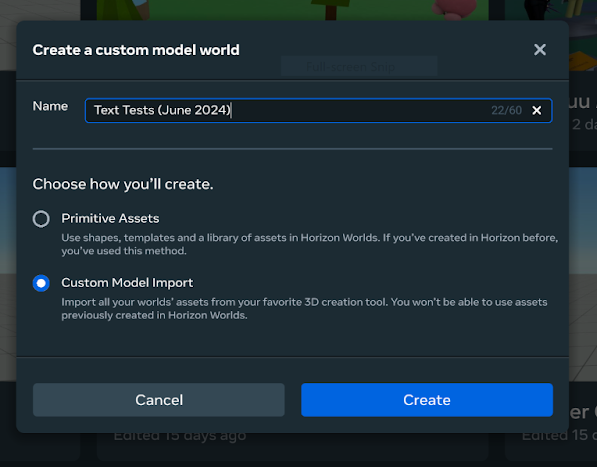

Adding the Text Gizmo, to a scene using the Desktop Editor is difficult. Meta recommends that you add the Text Gizmos in VR. But writing text in VR is also difficult, especially if you want to add any of the formatting options. If you want to use the Desktop Editor, see Adding text gizmos using the desktop editor.

1. Add a text gizmo to your scene.

1. Select the text gizmo from the Hierarchy.

1. Edit the text field in the Property Panel. You can also adjust properties, like font size and color, just like you can in VR.

    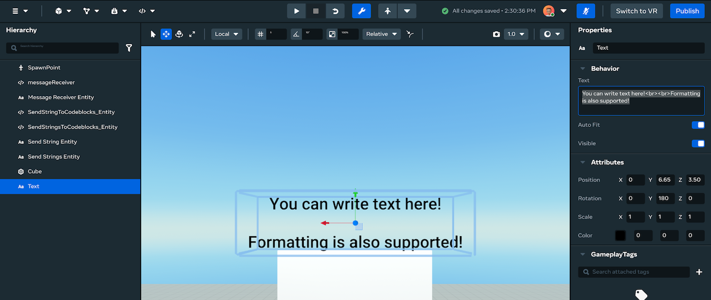

You can use the text field to write text and to copy and paste text into the text gizmo.

## Adding Text Gizmos Using the Desktop Editor

Here are some tips to help you if you want to add a text gizmo using the Desktop Editor.

1. Add a text gizmo to your scene, here are a couple of tips to make your life easier.

    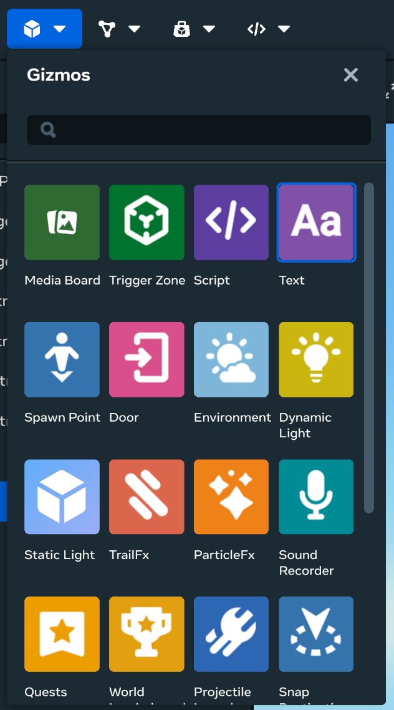

1. Add some filler text on the properties panel, in this case, in the image below, we have added “Hello World.”

    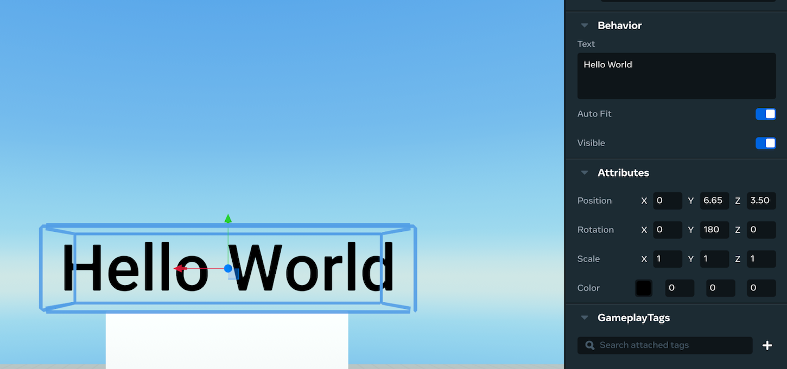

1. Then, presuming you have an object you want to place the text up against, click on that reference object and right-click to copy the position of the reference object.

    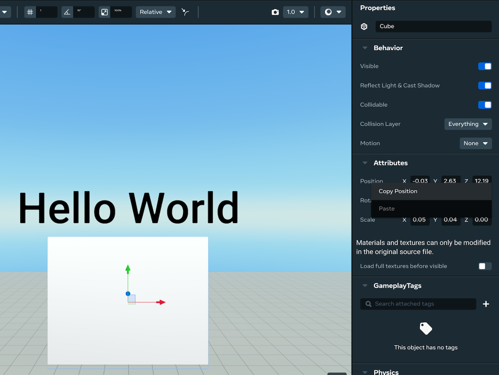

1. You can then click on the Text Gizmo and right-click to paste the position. You may have to repeat these steps to paste the rotation from the reference object as well.

    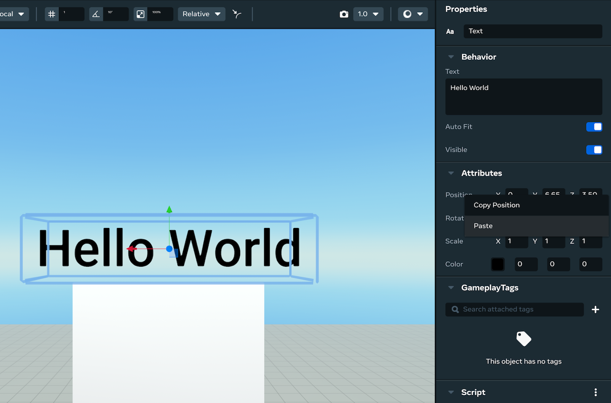

1. Then, with the slide tool selected, and snapping turned off, grab one of the slide arrows to pull the text out of the reference object.

    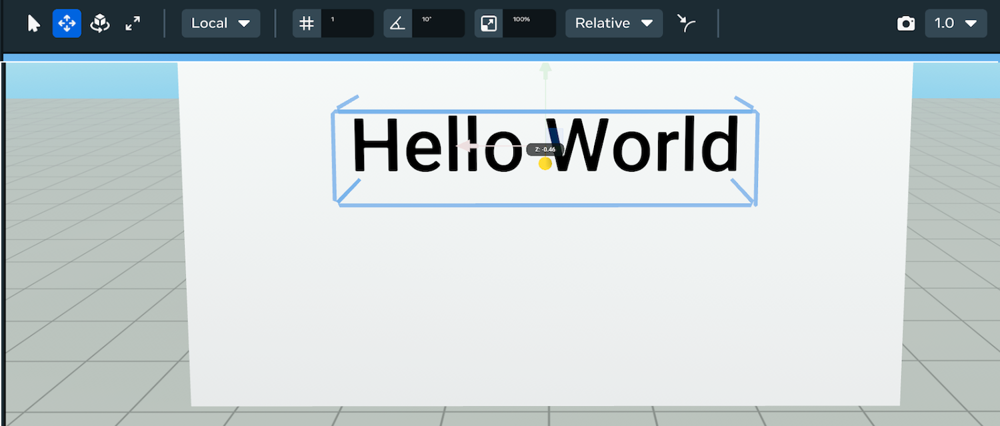

1. Now that you have positioned the text, it may need to be rotated. If you copy and paste the rotation of the reference object, and it is still off, you may consider manually adjusting the values from the properties panel. Or you can use snap rotation, I like to set it to 90 degrees.

    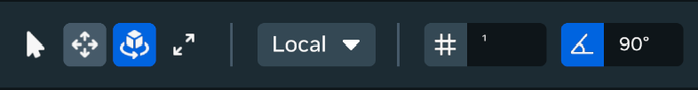
    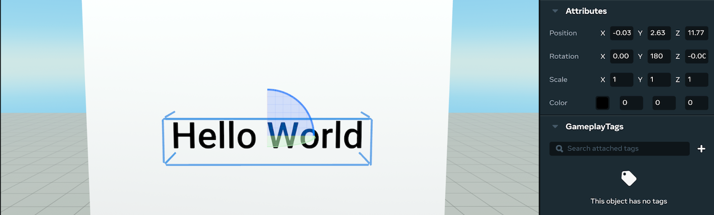

You should now have your text positioned and can fill out the text and properties to your liking.

## Script 1 & 2: Send String(s) from TypeScript To Codeblock scripts

In this first script, the goal isn’t to cover advanced TypeScript concepts but to simply allow you to use TypeScript code to augment your Codeblock scripts that need more rich text. You’ll do this by sending a string variable as a parameter. This can also be a list of strings. The script calls lists in TypeScript Arrays. It alternates between those terms in this section, referring to them as Lists when talking about Codeblocks, and Arrays when talking about TypeScript.

It’s important to start by noting the limitations of Codeblocks strings and lists. Both are limited to 1000 characters. There’s a maximum of 1000 items in Codeblock list, and a maximum of 1000 characters in a Codeblocks string. These limits don’t exist in TypeScript strings and Arrays. This is why you should consider learning TypeScript. TypeScript doesn’t get around the 1000-character limit of the Text Gizmo, so you might need to divide your text into multiple Text Gizmos.

This tutorial uses the Meta Horizon Worlds TypeScript 2.0 API. which as of July 2024 is the default, however, if you are not in 2.0, you may need to adjust your version from the Scripts tab, select the gear icon, and then Settings.

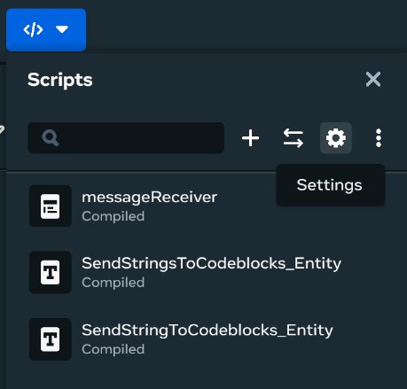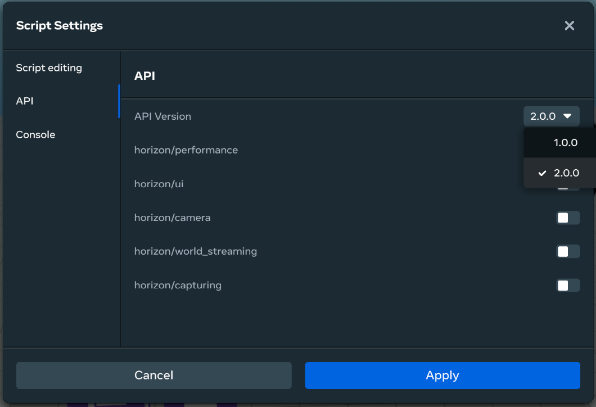

1. If you would like experience writing TypeScript you can create a new script from the Scripts drop-down, in this case, we will name it **SendStringToCodeblocks_Entity.**

    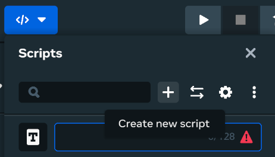

1. You can then write the following script out.

    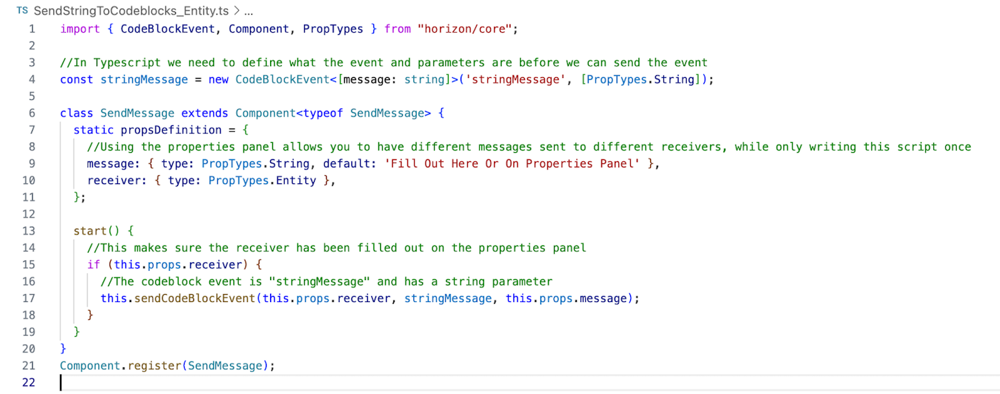

1. If you have never used TypeScript before, you should download this script by [clicking here](text-entry-utils/SendStringToCodeblocks_Entity.ts).

1. Open the Scripts folder. Click on the **Scripts** drop-down, then select the three-dot icon, and “**Open the Scripts Folder in Explorer**.

    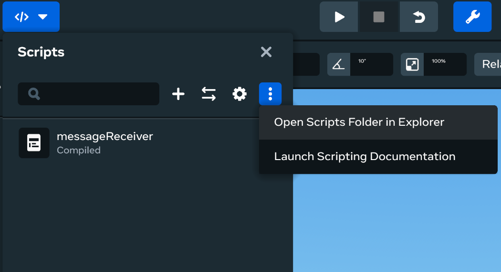

1. Drag the script into the scripts folder.

    

As you are writing or downloading these scripts, here is the second script you will want to [click here](text-entry-utils/SendStringsToCodeblocks_Entity.ts) to download.

Create a new script. Name it `SendStringsToCodeblocks_Entity`.

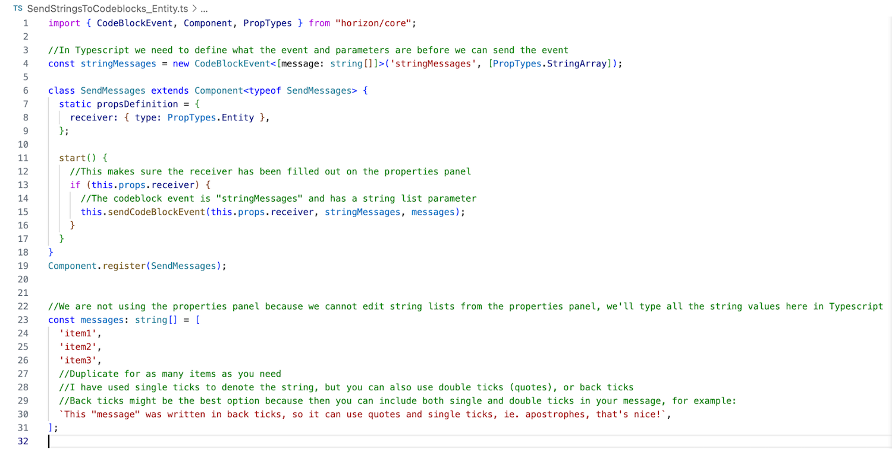

These two scripts serve slightly different purposes, the first one is for sending a single string, and the second an Array/List of strings. Unlike Codeblocks, not all TypeScript scripts have to be attached to an Entity (referred to as an object in Codeblocks), these two scripts, however, do need to run on an Entity so that you get access to the properties panel, allowing us to reference and send an event to another Entity, one that is running the Codeblock script you want to receive the string(s) on.

With the single string, you can reuse the script over and over, only needing to attach the script to another entity and adjust the “message” being sent from the properties panel. Don’t forget to reference the receiver on the properties panel too (notice in this photo no receiver is selected).

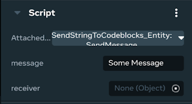

For multiple strings, you’d need to be more creative with your scripting to reuse the script. So instead, for simplicity, it is recommended to duplicate the script and give it a slightly different name. Note that you will need to have installed VS Code to modify the script (remember to restart your computer after installing). You can then modify the script by pressing the three dot icon next to the script name in the scripts drop down, and clicking “open in external editor.”

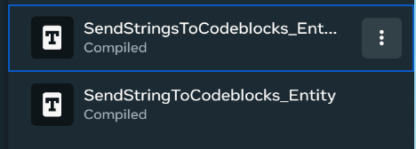

Here inside VS Code, you can modify the array of messages to suit our needs, adding as many lines as you want.

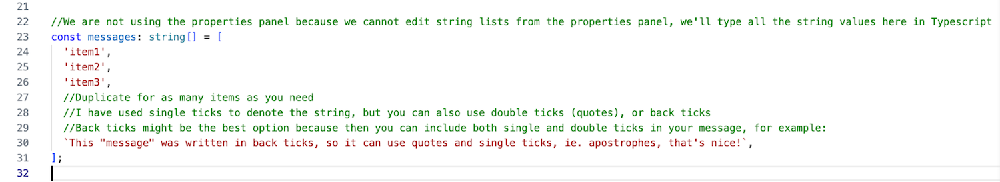

With these scripts ready to go, you’ll need a Codeblock script to receive the message(s), a very simple script is shown below to demonstrate that it works by printing the message to the console:

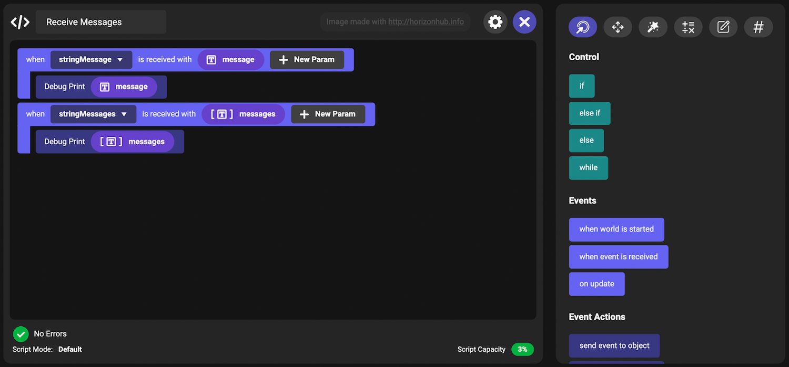

Be sure to attach the scripts to entities. Attaching scripts is done at the bottom of the properties panel. In this case, text gizmos are used to run each of the scripts. If you give them good names, it’s easier to find them in the hierarchy.

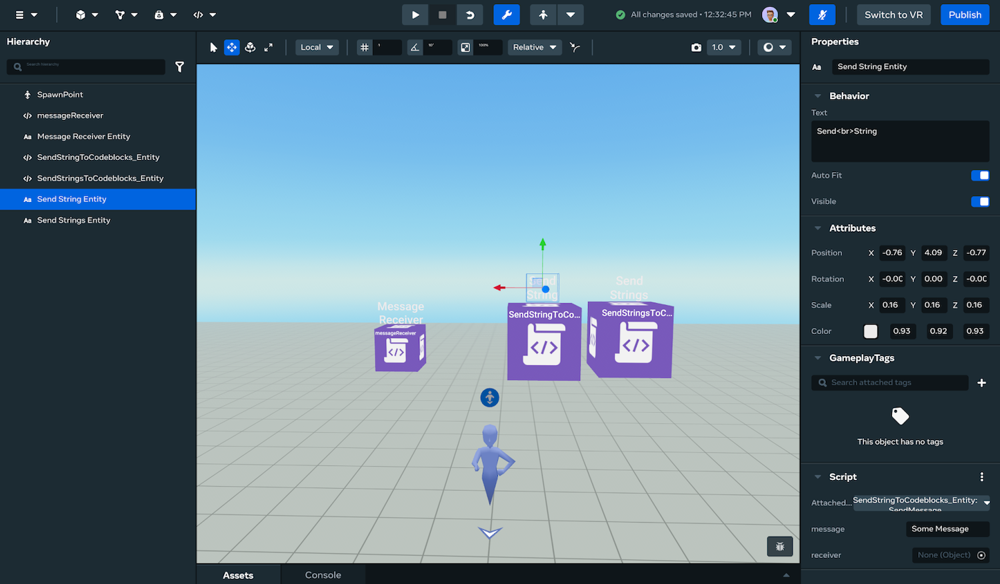

You can then drag the codeblocks receiver from the Hierarchy to the empty pill slot (the pill-shaped field in the bottom right corner with a circle-like icon.).

**Note**: You can also click on the pill slot to see a list of all the items in our world, and from there, at the top, you can search from the drop-down.

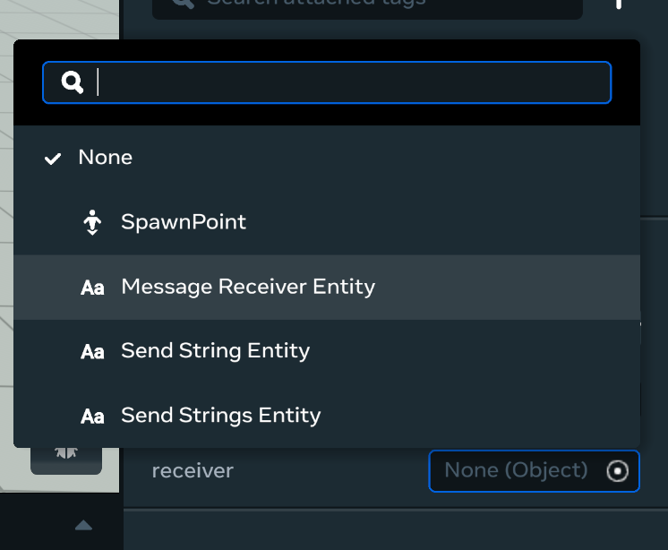

**Bonus Tip:** You can find entities running a specific script by using the hierarchy filter, and selecting entities running a specific script.

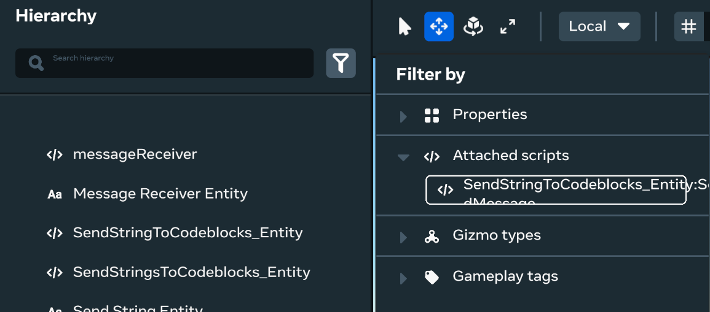

Run the world and see a console message displaying our messages.

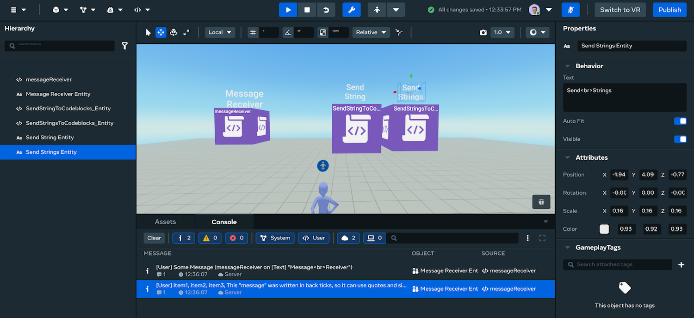

## Script 3: Send Q&As From TypeScript To Codeblock Scripts

In this example, you’ll expand on what you learned in the first two sections. Instead of just sending data, now you will allow the Codeblock script to request two pieces of data: a question, and a list of possible answers.

You’ll need to create a new type of data called QuestionData that stores this string question and string array of answers. You might imagine this is a game show, and only the first answer in the array is the right answer, you could then randomly select wrong answers to mix in, scrambling them when displayed to the contestants.

You won’t be diving too deep into this script, which you can download [here](text-entry-utils/GetQuestionData_Entity.ts), as it does show off some more advanced features, but if you have managed to do script 1 or 2 in the previous step, you should have no problem implementing this code.

**Mentor’s Note:** The “getRandomItemFromArray” function comes from a file that I add to all my worlds, and when it gets updated is shared in Discord. You can download the arrayUtils (created by the Vidyuu team) by clicking [here](text-entry-utils/UtilArray_Func.ts). Feel free to ask questions in Discord if you’d like to learn more.

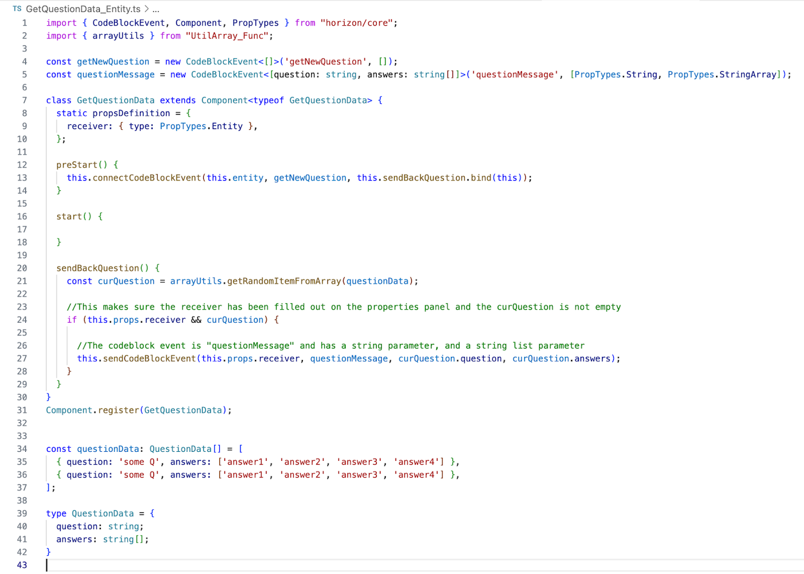

If you would prefer not to use the Vidyuu arrayUtils file, below is what that would look like. Instead you use a copy of the function from the arrayUtils file, pasted at the bottom of the script.

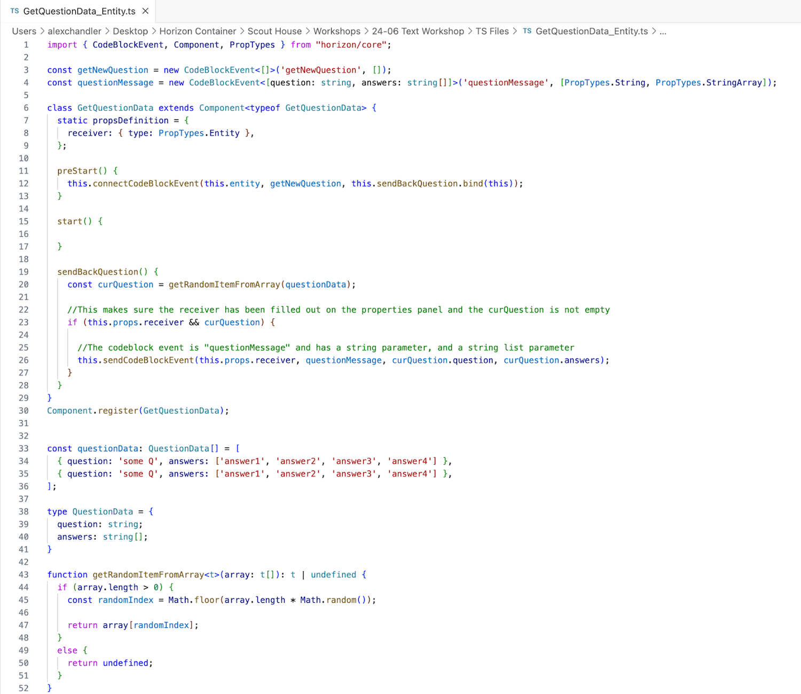

To send this data to a Codeblock script, you created and then used a CodeBlockEvent with two parameters; String, and StringArray. This is received as a string, and string list, as seen in the screenshot below.

Note that this demo Codeblock script, receiver, will also need to be attached to an entity to run, and reference the entity running the QuestionData script. The QuestionData script will also need to reference this “receiver.” For this demo, you get a new question on world start and when received, print it to the console.

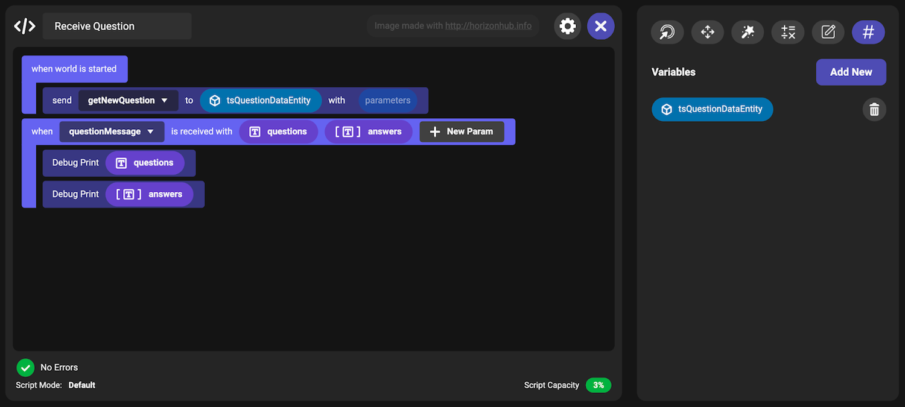

**Mentor’s Note:** This is just a taste of what easier text entry with TypeScript can unlock. Really looking forward to seeing how you use this in your worlds.

## Script 4: Receive Text In TypeScript From Codeblock Scripts

Next up we have one last Codeblock integration example.

In this case, you’ll send a message to TypeScript from Codeblocks. You can imagine an event in Codeblocks like this, with a string parameter as the message.

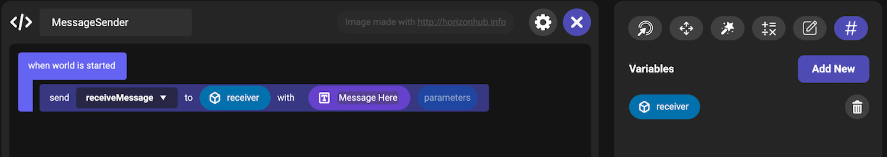

Then to receive the message in TypeScript, you will need to create a new CodeBlockEvent, which includes a parameter (slightly different from the previous example with no parameters). Then just connect the event like before, and in this case, you will log it to the console to show that it was received. You can download this script [here](text-entry-utils/TypeScriptReceiver_Entity.ts).

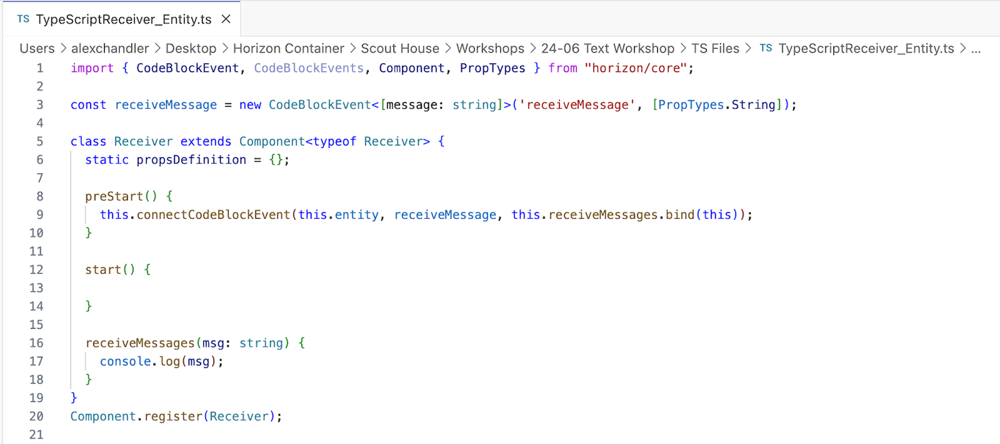

**Note:** If you are planning to stick with Codeblocks, this is the end of the Codeblock integration examples.

## Script 5: MegaText

If you haven’t used MegaText in Horizon, it a script written by the  Vidyuu team in the Asset Library under interactive. It allows you to write text on a Text Gizmo with multiple lines. This makes formatting so much easier. The example below is the same script, rewritten in TypeScript, you can download it [here](text-entry-utils/MegaText_Entity.ts).

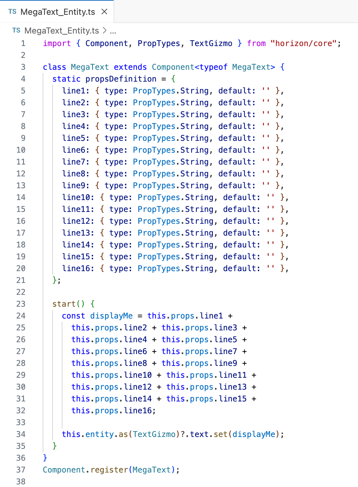

The biggest difference is that this example only has 16 lines, and the Codeblocks asset has 32. You can duplicate row 20 and 31 to add more lines. Just make sure they are added in order and named appropriately.

To use MegaText, attach this script to a TextGizmo, and on the properties panel you can fill out multiple lines, making it much easier to write large blocks of text, and even add formatting. I’ve always recommended leaving gaps between lines so that you can come back later if you ever need to insert or add formatting styles. You can use this script both in the Horizon Desktop Editor and in VR.

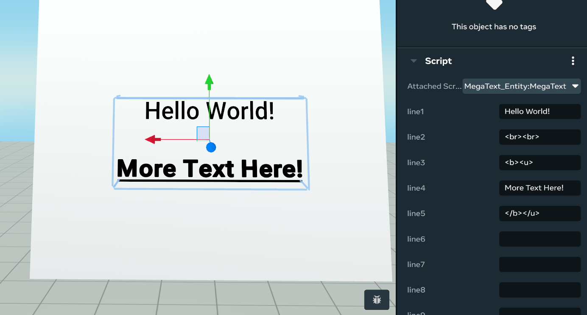

## Script 6: Writing Text With Formatting In TypeScript

In this section,  you’re going to write text in TypeScript, and apply it to a TextGizmo that is running the script. You can download this example [here](text-entry-utils/EasyText_Entity.ts).

You’ve defined font and lineBreak string variables. This makes our lives a little easier, by making it so that you don’t have to remember or retype the angle brackets and this also makes our script easier to read. In addition, outside our class, you’ll notice the bold function allows us to easily apply bold to a string.

In start, you define a couple lines, add them all together using displayMe, and then apply the displayMe string to a TextGizmo.

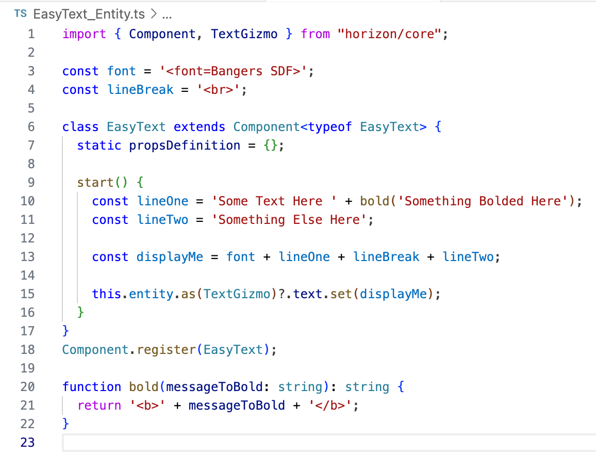

You will need to make copies of this script if you want to have different text on multiple TextGizmos. Note that the name of the script needs to be unique, but the class in the script can have the same name, in this case “EasyText.”

Below you can see creating a new script with a different name, I would advise naming this based on the text they display. Then in VS Code you can copy paste the first script to replace the default script in EasyText2, filling it out with your new text. Notice that when you assign the script, on the left is the script name, and on the right is the class name.

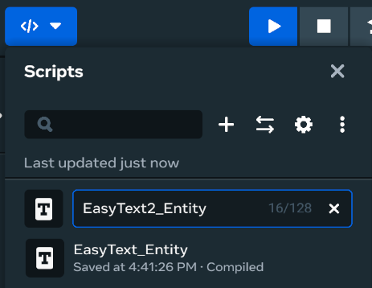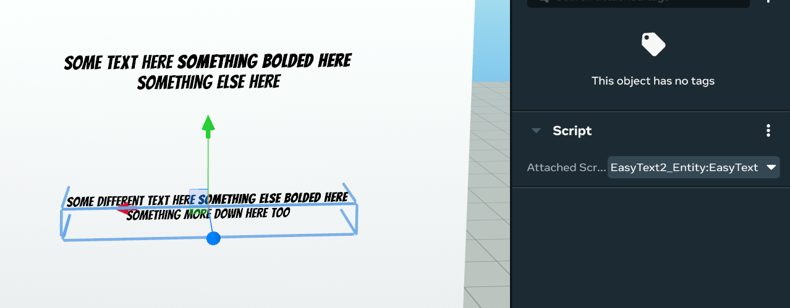

This example script has shown you how you can take the formatting options shown at the beginning, and apply them on your own. While this works wonderfully, as a part of this tutorial, I put together a formatting library, which you’ll see in the next step makes our lives even easier.

## Script 7: Write Text With a Formatting Library

This next script for you to [download](text-entry-utils/UtilTextGizmo_Func.ts) is from the Formatting Library (written, a Utility script that you can use to make writing text with formatting a lot easier). If you have never used a library before, it is similar to an API, in that it provides you with additional functionality. To use, simply copy the UtilTextGizmo_Func.ts file from the above download link into your scripts folder. You can then use the provided “formatting,” “Formats,” “Fonts,” “Materials, and “Gradients.”

Below is a simple demo, which can be downloaded by clicking [here](text-entry-utils/EasyTextWithFormatting_Entity.ts).

In this example, you imported “Formats” and “formatting” from the UtilTextGizmo_Func.ts file. For the “title”, you have a string that gets three formatting options applied. After typing “formatting” when you type “.” a list of formatting options appear. Including a second list of “specialFormats.” You’ll notice that “Formats.bold” allows the applyFormat function to apply the bold format on your title. “Formats,” similar to “formatting,” also has a drop-down list after typing period.

And then similar to Script 6, you add the title and lines together. In this case, you use formatting to get an easier way of typing in line breaks. And then finally you display the string on the TextGizmo that has this script attached.

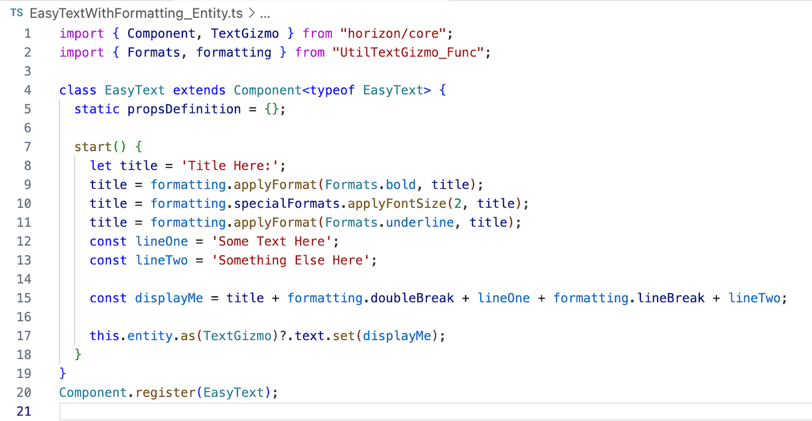

Using this on multiple TextGizmos will require you to duplicate the script. give it a good name, and then attach the new script to the relevant TextGizmo. This isn’t the only method, as you could have one text manager that has the TextGizmos referenced on its properties panel. So depending on your needs, be creative and feel free to ask for help in Discord.

In addition to “Formats” there are three other enums, which have their own formatting.apply functions you can use:

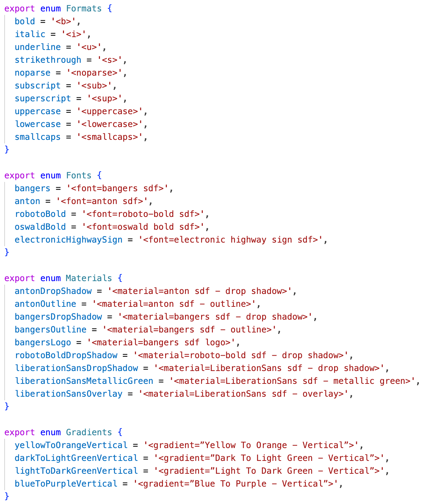

You can also use these on their own, if you don’t need to clear them at the end, ie:

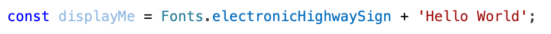

Feel free to dig into the utility file on your own and learn more about how it works and what options are available.

## Script 8 & 9: Ad Lib Story Example

This next section may feel a bit intimidating because you’ll be using multiple scripts. The first script is where all the logic is stored. It is where you’ll spend most of your time. The second script is a data file, storing various strings in JSON objects. The last two scripts are utilities you have already used. They’re the formatting and arrayUtil libraries which allow you to easily apply formatting and work with arrays.

You can download the files here:

* [EasyStoryTrigger_Entity.ts](text-entry-utils/EasyStoryTrigger_Entity.ts)
* [Story_Data.ts](text-entry-utils/Story_Data.ts)
* [UtilArray_Func.ts](text-entry-utils/UtilArray_Func.ts)
* [UtilTextGizmo_Func.ts](text-entry-utils/UtilTextGizmo_Func.ts)

Let’s start with `Story_Data.ts`, which is a relatively simple file that creates four string arrays, and then stores them in an exported JSON object called storyData. You can access all of these strings from your main script by importing storyData. You can imagine having as many of these string arrays as you need for your story.

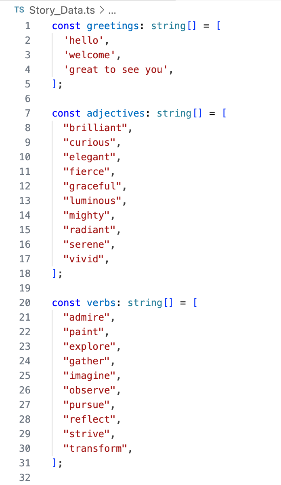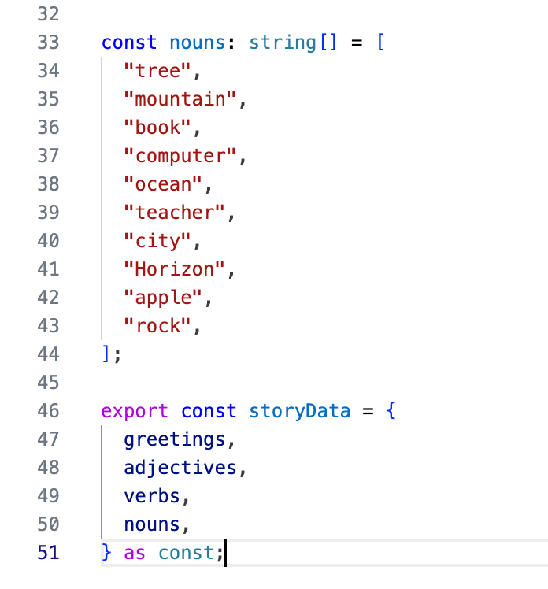

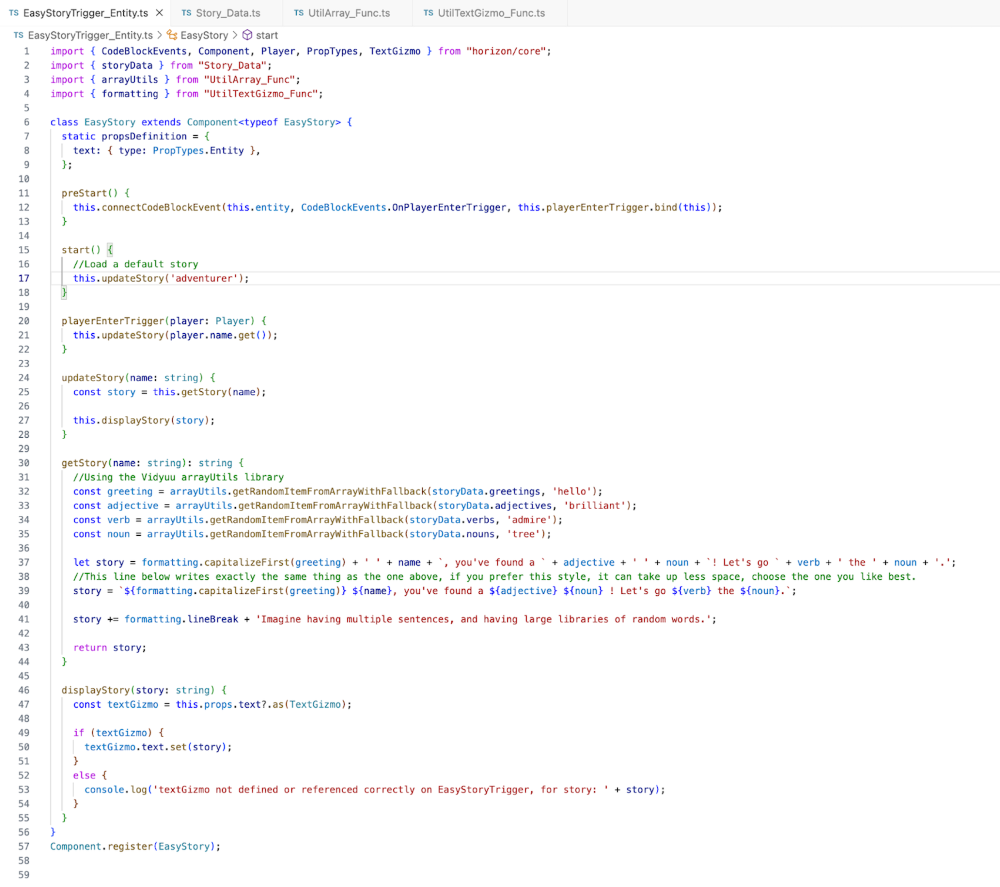

You can now see this all come together in the EasyStoryTrigger\_Entity.ts script above. The first thing you’ve probably already noticed is that you attach this demo script to a Trigger Gizmo. This allows you to test our script by simply touching a trigger. This does mean you need to reference the TextGizmo, which you do on line 8 in the propsDefinition. You must make sure to fill this out on the properties panel of our trigger that is running this script.

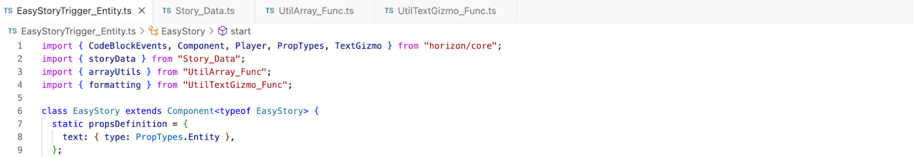

In preStart, you connect the OnPlayerEnterTrigger event to our local method. In start(), you load a default story using ‘adventurer’ to fill in as the name for a player. You can see the playerEnterTrigger method also calls updateStory.

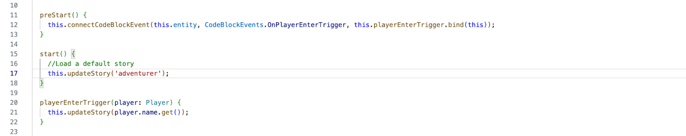

The updateStory method starts by getting a story and then displays the story. Each of these are separate methods shown below. One returns a string, and the other updates the TextGizmo.

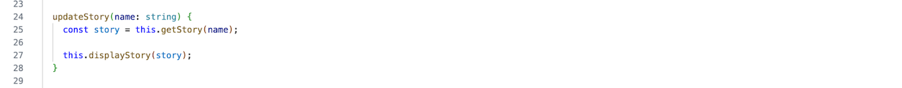

The getStory method is where all the magic occurs. It takes a name, ie. the player name, and returns a string, which is the story. The first thing you do in this method is set several variables by selecting a random string from storyData, and providing a fallback, in case our array of strings is empty.

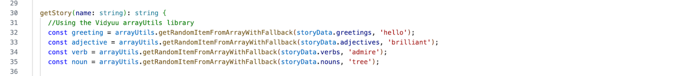

You then use formatting to capitalize the first letter in the greeting. There’s a second example on line 39, which sets the text to be the same as what’s on line 37\. This is to show that you can choose the method of writing your story that makes the most sense to you. I personally prefer plusses “+” but the line 39 method takes up less space, and for some is easier to read.

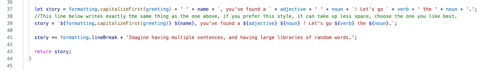

Now that you’ve calculated the story, you can now return it.

Display story is similar to what you’ve done earlier in this tutorial, except you added a check and console log if the text property has not been referenced or doesn’t reference a TextGizmo.

From this, you can extrapolate to create your own custom ad lib story. If you have questions or need help, don’t hesitate to ask in Discord.

## Script 10 & 11: Random Ad-Lib Story Example

In this section, you’ll elevate your ad lib story generation by randomly selecting a story and player. To do this, you’ll continue using the Story_Data and utility scripts. You’ll add to it with an AdvancedStoryTrigger_Entity script, and an additional import called storyFunc.

You can download the new files here:

* [AdvancedStoryTrigger_Entity.ts](text-entry-utils/AdvancedStoryTrigger_Entity.ts)
* [Story_Func.ts](text-entry-utils/Story_Func.ts)

Let’s start with something familiar, looking at Story_Func. This is similar to our data file in that you have an exported variable, but instead of storing string data, it stores an array of functions. The creation of storyFunc declares itself to be an Array of functions that take a string parameter and return a string. This is just like our getStory method from script 8\. In fact, line 10 is the same method, but as a function called story1. You can then duplicate this for as many stories as you want. Just make sure they are included in the array on line 5.

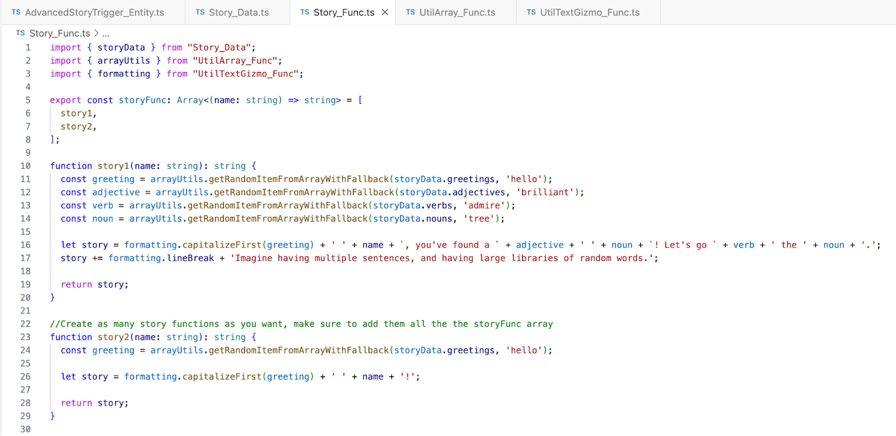

Next, you can take a look and see how this is used in the trigger script. The first difference you’ll notice is that you have an array of activePlayers, and in preStart you connect PlayerEnter and PlayerExit world events. Seen below on lines 23 and 27, you add players to the activePlayers array using push, and remove them using the arrayUtils removeItemFromArray function.

The next major difference is that in the playerEnterTrigger, you now select a randomPlayer and update the story using that player’s name.

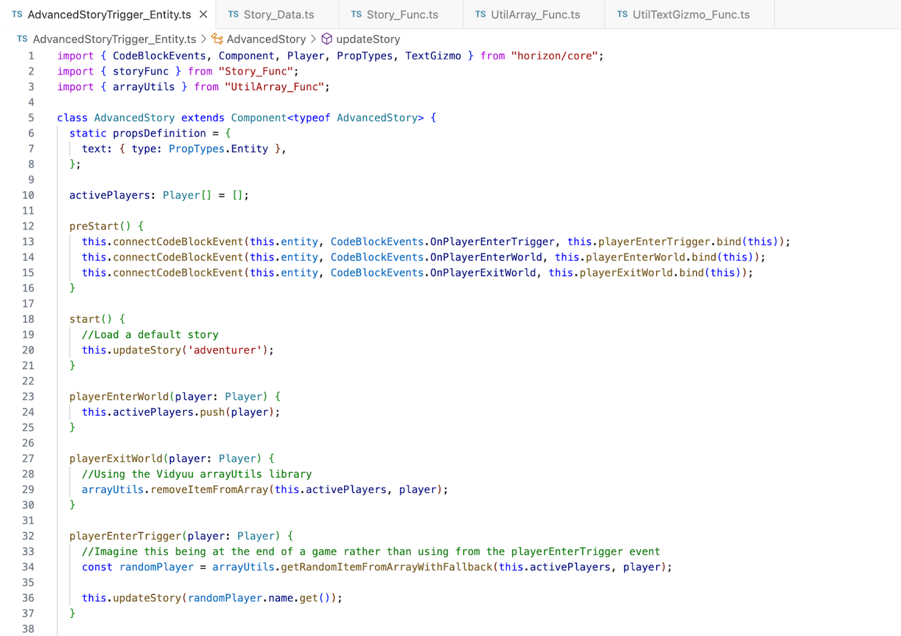

The next change is inside of getStory. You’ll get a randomStoryFunc from the array of storyFunc. If it is defined, then you’ll use it to generate a story. Otherwise, the list of functions may be empty, and you’ll log an error to the console, returning an empty string.

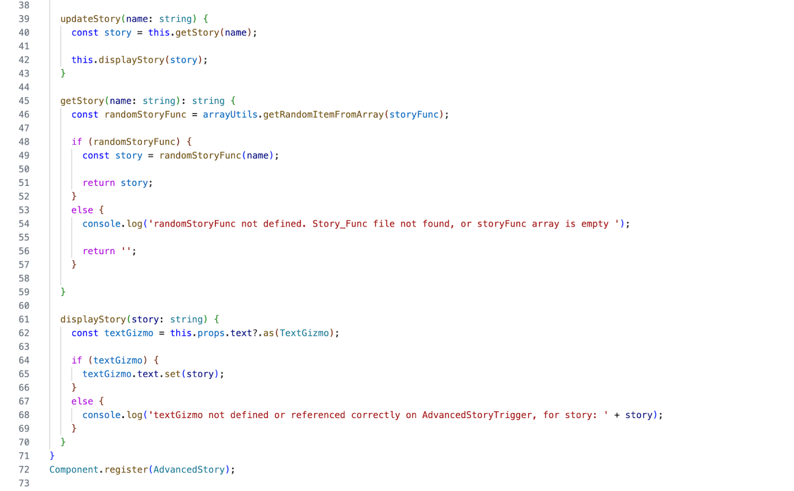

And like that, you can have as many random ad-lib stories as you want.

## Extended Learning

Below are challenges that you can implement on your own. The Advanced task might require some outside knowledge. We encourage you to ask questions in Discord if you get stuck or are unsure how to complete any of these.

**Novice**
Fix spelling mistakes and add formatting to pre-existing large blocks of text in TextGizmos.

**Intermediate**
Write your next large text paragraph using TypeScript and the provided Vidyuu formatting library.

**Advanced**
Integrate a randomly generated story into one of your worlds.

## Further Assistance

For any questions or further assistance, creators are encouraged to join the discussion on the community forum.